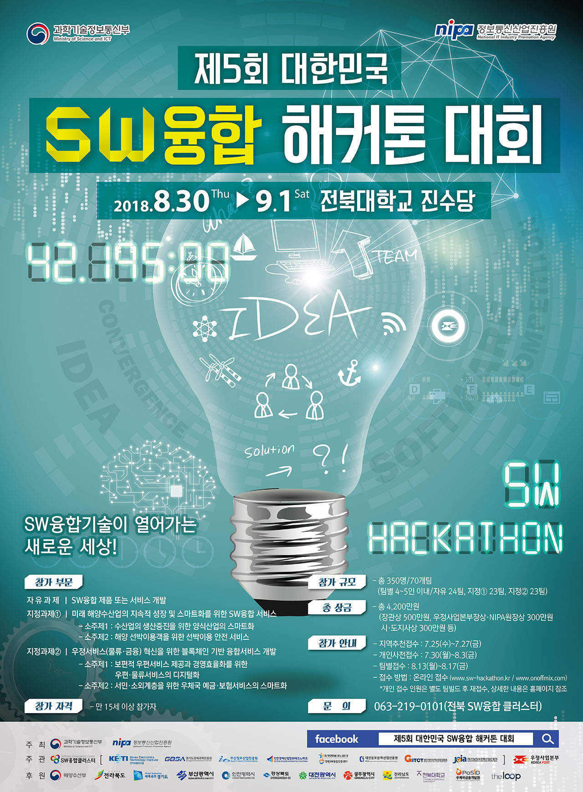
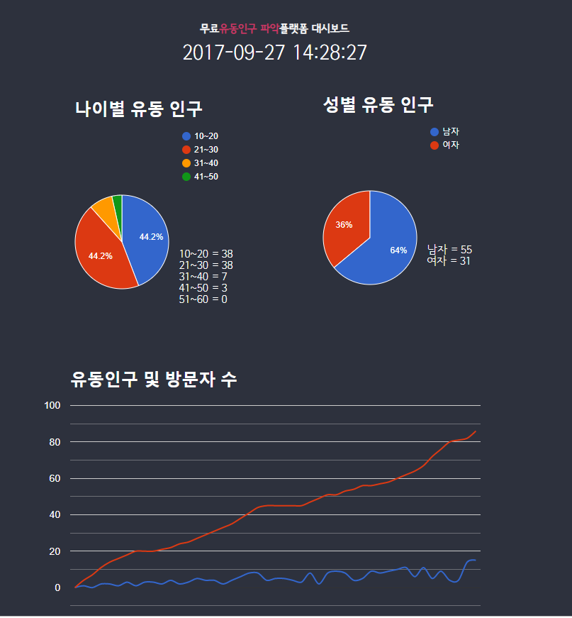

# 제5회 대한민국 SW융합 해커톤 대회

## Team
- 개발몽키즈
  - Leader : [`현운용`](https://github.com/soronto3603)
  - Member : [`류동준`](https://github.com/rdj94), [`이동건`](https://github.com/Sotaneum), `박건우`

## Project

- 스마트록 : 스마트 옵젝트 트래커 - 무료 유동인구(수, 연령, 성별, 동선) 파악 플랫폼

- 소프트웨어 ( window-client, api-server ,web-server, web-client )
- Python , NodeJS , ReactJS , PHP 

- [시연 영상](https://www.youtube.com/watch?v=7rYi9RYZ6FY)

## Role

- 테스트 데이터 생성, Python
  - [CreateJSON](./CreateJSON/README.md)
- 프론트엔드
  - [jQuery](https://jquery.com/), [Google Charts](https://developers.google.com/chart), json, javascript, HTML, CSS
  - 프로젝트에서 통계를 볼 수 있는 화면 일부를 담당햇습니다.
  - 서버에서 받은 JSON데이터를 받아 화면에 시간단위로 변화는 모습을 보여줍니다.
  - 맡은 부분에서 일부인 [Preview](http://duration.digimoon.net/dev/hackathon/2018-sw-hackathon/)에서 사용해 볼 수 있습니다.

    
    
    - 테스트 함수
      - startRun(mesc , json data) : 갱신되는 속도와 json 데이터를 입력하면 화면에 출력합니다.
      - start(mesc) : 갱신되는 속도를 입력하면 임시로 들어가 있는 데이터를 불러와 보여줍니다.

## What did you learn?

- React JS
  - React JS를 처음 접하게 된 계기가 되었습니다.
  - State의 기능에 대해 배웠습니다.
  - Component에 대해 배웠습니다.
- Google Charts
  - 데이터에 맞도록 그래프를 셋팅하는 방법을 배웠습니다.
  - 기본 셋팅 외에 새로운 데이터를 기입하는 방법을 배웠습니다.
  - 데이터가 실시간으로 변화는 모습을 구현할 수 있게 되었습니다.
- Javascript
  - json을 파싱하는 방법을 배웠습니다.
- Slack
  - 사용방법을 익히게 되었습니다.

## Finally

- 비록 우승하지 못했지만 해커톤이라는 대회를 처음 경험할 수 있는 기회가 되었습니다.
- 다른 사람과 함께 무언가를 만든다는 것은 즐겁고 재미있다는 것을 깨닫게 되었습니다.

## Modify Content

- 2018-09-01
  - 해커톤 종료 및 내용 정리
